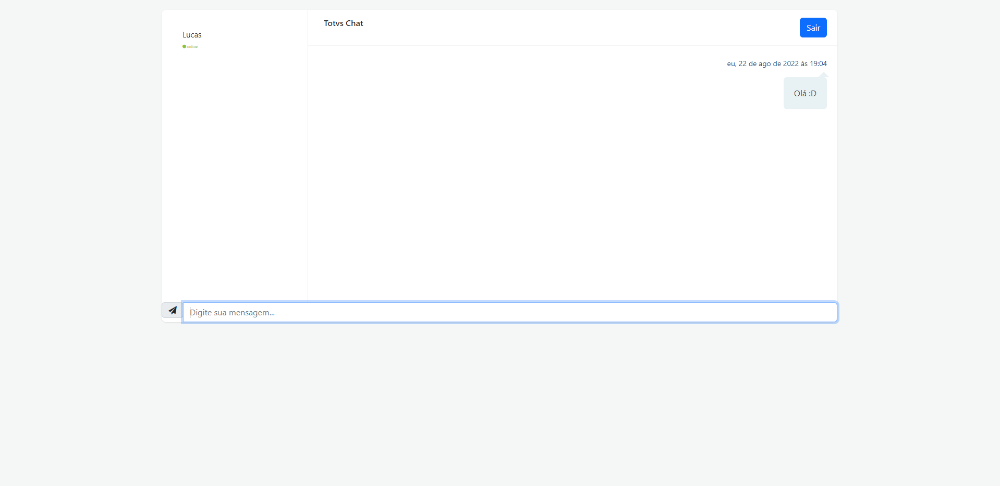

<h1 align="center">:file_cabinet: SafeChat - Totvs (versão de teste)</h1>

## :memo: Descrição
O SafeChat foi criado com o objetivo de ser um sistema de conversas, um aplicativo de chat, para a troca de informações entre o suporte e o cliente que depende de um sistema. 
O chat foi desenvolvido para facilitar essa comunicação, tinha como objetivo ser feito em uma estrutura Serverless e utilizar os serviços de nuvem para sua execução.
Essa primeira versão, funcionou como uma versão de testes e roda com o uso de WebSocket. Inicialmente funcionava com um servidor node local, depois alterado e feito o deploy para a aws, porém rodando em um ambiente Elastic Beanstalk.

*<b>Link de acesso:</b> http://node-express-env.eba-jariawkj.us-east-2.elasticbeanstalk.com/

## :books: Funcionalidades
* <b>Login</b>: O usuário é identificado e registrado por meio de uma chave na própria URL. O sistema não conta com um banco de dados estruturado.
* <b>Mensagens</b>: As mensagens são registradas de acordo com o usuário e horário da mensagem. Conta com a possibilidade de saída da conversa, é registrado o momento de entrada e saída, além de identificar os usuários logados. 

## :wrench: Tecnologias utilizadas
* JavaScript;
* CSS3;
* NodeJS;
* HTML5;
* Bootstrap 5;
* AWS Services;

## :rocket: Rodando o projeto
* Página inicial

* Cadastro

* Verificação

* Novo Usuário

* Nova Conversa

* Mensagem

* Outro usuário

* Conversa simultânea

